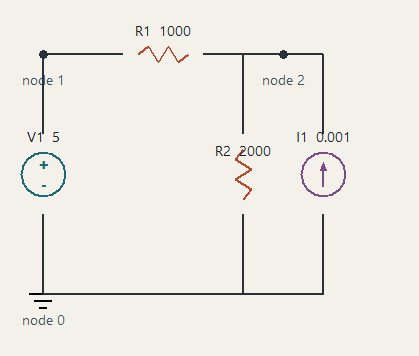

# Circuit Simulator

An incremental Python 3.12+ learning project based on Farid N. Najm's
*Circuit Simulation*. The first milestone reads a restricted netlist and
displays it as a read-only Tkinter schematic. It does not solve circuits yet.

## Current State

Milestone 1 is complete. The project currently:

- parses the restricted Chapter 1 netlist language;
- preserves node order, source polarity, and current direction;
- validates records with line-numbered errors; and
- displays the parsed circuit in a deterministic, read-only Tkinter viewer.

The current viewer displays the example voltage source, resistor network, and
current source:



Verified dense static MNA assembly for resistor, voltage-source, current-source,
capacitor, and inductor circuits is now available in `circuit_sim.mna`.
Capacitors are open circuits and inductors are ideal zero-voltage branches in
this formulation. Circuit solving remains planned for Milestone 3.

## Setup and Run on Windows

Open this repository folder in VS Code. The workspace settings use the local
`.venv` interpreter and configure pytest automatically.

Run these commands once from the repository root in PowerShell:

```powershell
py -3 -m venv .venv
.\.venv\Scripts\Activate.ps1
python -m pip install -e ".[test]"
```

The install command reads all dependencies from `pyproject.toml`, including
NumPy and pytest. After installation, use the Testing tab to discover and run
tests. You can also run them from PowerShell:

```powershell
python -m pytest
python -m circuit_sim.viewer examples/first_circuit.net
```

VS Code also provides these tasks through `Terminal > Run Task`:

- `Install project dependencies`
- `Run pytest`
- `Run example viewer`

If the Testing tab is empty, run `Python: Select Interpreter` from the Command
Palette and choose `.venv\Scripts\python.exe`, then refresh the tests.

The parser is independent of Tkinter and returns plain dictionaries that
preserve terminal order and source direction. See
[`docs/project-guide.md`](docs/project-guide.md) for project scope, status,
and roadmap; [`docs/parser-viewer-spec.md`](docs/parser-viewer-spec.md) for
the input and drawing contract; and
[`docs/commit-workflow.md`](docs/commit-workflow.md) for repeatable phase
commits and commit-message conventions.
